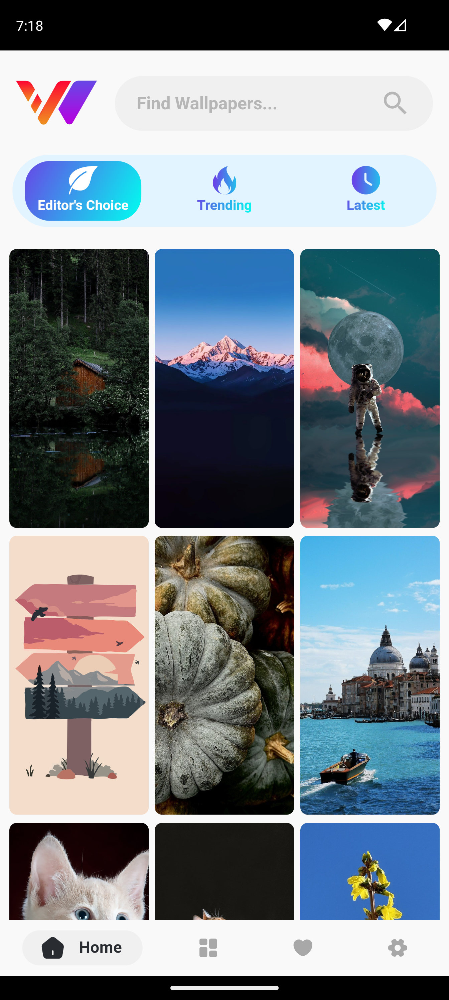
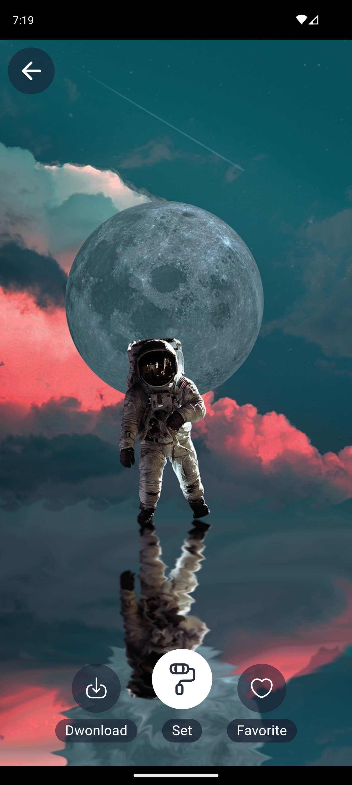
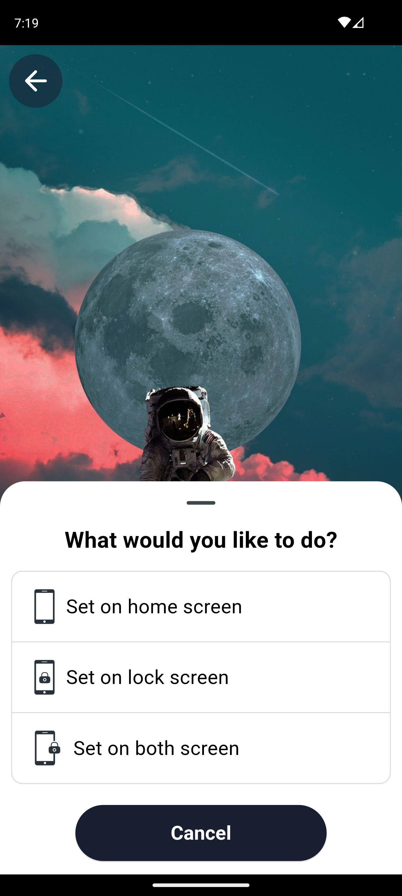
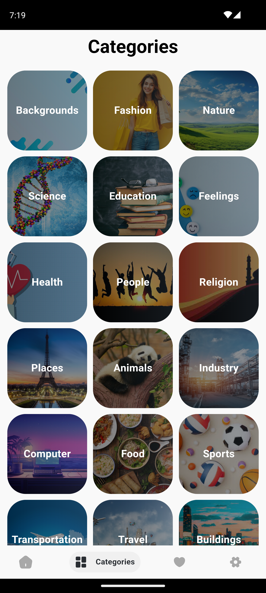
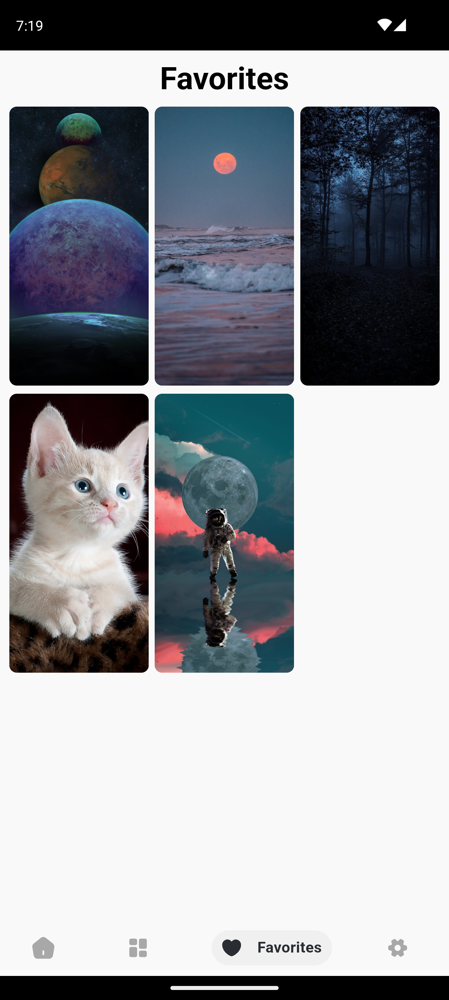
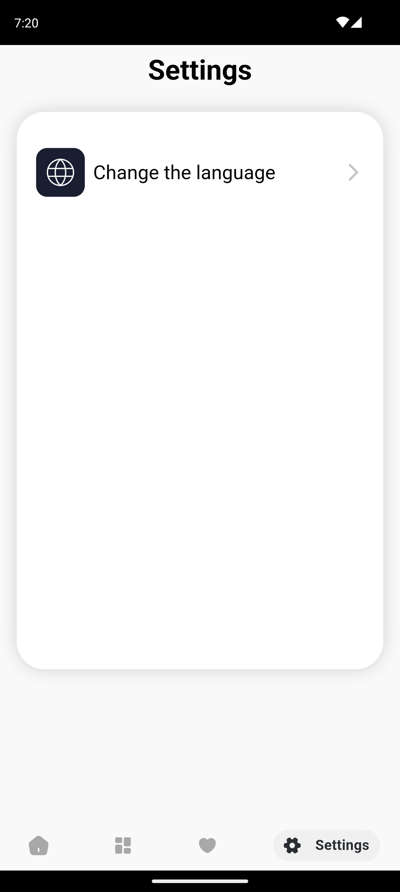

# Wallpaper App 🎨


An app to explore, search, and download high-quality wallpapers for your device.

---

## Design Inspiration 🎨

Design Inspiration: [View Design Inspiration](https://www.figma.com/community/file/1330738288338602030/4k-wallpapers-app-ui)

---

## Download the App 📥

Download the APK for Android: [Download APK](https://drive.google.com/file/d/1aAij7iNpnJ2jV4bsJC3d-zxs8TX9VBTK/view?usp=drivesdk)

---

## Screenshots

 Home Screen             | Wallpaper            | Set Wallpaper     
:------------------------:|:------------------------:|:------------------------:
  |  |  

 Categories             | Favorites      | Settings         
:------------------------:|:------------------------:|:------------------------:
  |  |  
                      


---

## Installation

Follow these steps to set up the app:

1. **Clone the repository**
    ```bash
    git clone https://github.com/Dilman01/wallpaper_app.git

    cd wallpaper_app
    ```
2. **Get a Pixabay API Key**
   * Visit [Pixabay Website](https://pixabay.com/) to Sign up or log in to your Pixabay account
   * Visit [Pixabay API Documentation](https://pixabay.com/api/docs/).
   * Scroll down and you will see your API key in the Parameters section.
  

3. **Add the API Key to the project**
   * Create api_key file in the following directory:
    ```bash
    lib/
    └── core/
        └── constants/
            └── api_key.dart  
    ```
    * In the api_key.dart file add the API key in the apiKey variable:
    ```dart
    const apiKey = 'your_api_key_here';
    ```
   
4. **Install dependencies**
   ```bash
    flutter pub get
   ```
5. **Generate necessary files**
   * Use the build_runner tool to generate required files:
   ```bash
    dart run build_runner build -d 
   ```
6. **Run the app**
   ```bash
    flutter run
   ```
---

## Contact
For questions or feedback, please contact dilmandev@gmail.com.